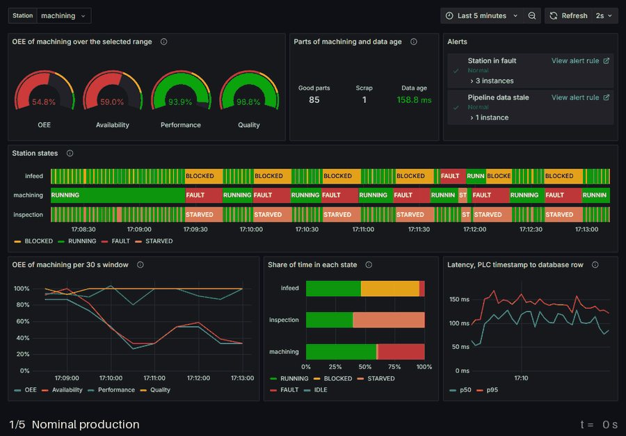
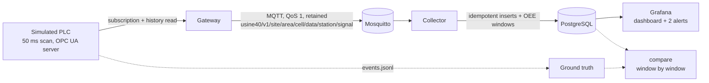

# usine40-cell-pipeline

[](https://github.com/guilhem0908/usine40-cell-pipeline/actions/workflows/ci.yml)

**A simulated Industry 4.0 production cell goes through OPC UA, MQTT, PostgreSQL and Grafana in one `docker compose up`, and the OEE on the dashboard is checked window by window against the simulator's own event log, with fault injection and every latency and loss number measured.**

[Results](#results) - [Quickstart](#quickstart) - [How it works](#how-it-works) - [Limitations](#limitations)



*Frames are real screenshots of the provisioned dashboard, recorded by `scripts/capture_dashboard.py`; only the caption strip is added.*

## Why this exists

I am a final-year robotics engineering student at UPSSITECH (University of Toulouse), and this year my class runs a team project on Usine 4.0, the Industry 4.0 smart factory (in progress). This repository is a separate personal study, built in October 2026 with AI assistance (Claude). At AIST in Tsukuba I prepared a ROS 2 publish/subscribe interface for a mobile robot with stale-frame rejection at 0.5 s, velocity clamps and a dead-man timer ([KachakaNavigation](https://github.com/guilhem0908/KachakaNavigation)). Here I wanted the same discipline on the machine side of a factory: stamp every value at the source, never trust a message because it arrived, count what was lost, and bound what an operator command may do. The question I set myself is whether the numbers on an OEE dashboard can be trusted, so the pipeline has to prove it against a ground truth and I measured what breaks it.

## Results

**The OEE stored by the pipeline equals the OEE recomputed from the simulator's event log in every window I compared (largest error 0.000 pp). The only way I found to make it wrong is to lose samples, which a 60 s gateway or broker outage does unless the OPC UA history replay (gateway) or MQTT QoS 1 (broker) is on: a lost state change corrupts availability and performance, a lost part-counter sample moves parts into a later window and OEE with them.**

The simulated cell has three stations: `infeed`, `machining` (the bottleneck) and `inspection`. OEE is compared per station over windows of 30 s.

### OEE against the event log

In-process runs (real OPC UA server, gateway and collector, substitute broker, SQLite, simulated time): 10 seeds of 60 simulated minutes, 3,600 station-windows of 30 s, 177,536 samples stored, 0 missing. Pipeline and ground truth agree to the last digit; the table is the sum over all seeds.

| Station | Parts | Good parts | Availability | Performance | Quality | OEE, event log | OEE, pipeline |
| :--- | ---: | ---: | ---: | ---: | ---: | ---: | ---: |
| infeed | 14,565 | 14,565 | 74.13 % | 95.26 % | 100.00 % | 70.62 % | 70.62 % |
| machining | 14,515 | 14,065 | 94.99 % | 92.61 % | 96.90 % | 85.24 % | 85.24 % |
| inspection | 14,059 | 13,518 | 62.59 % | 95.29 % | 96.15 % | 57.35 % | 57.35 % |

On the real stack (Mosquitto, PostgreSQL, wall-clock time): 18 station-windows over 180 s, 245 parts counted by the pipeline and 245 in the event log, largest OEE error 0.000 pp, 0 of 993 samples missing. A zero error shows that nothing was lost or invented between the PLC and the dashboard; it does not show that OEE is the right KPI (see Limitations).

### Outages

A 60 s outage, repeated on 5 seeds per scenario, in-process. "Never stored" counts samples (state changes, part counters, heartbeats) that the simulator produced and the database does not contain. The two kinds of lost sample do different damage. A lost state change is never restored: the station keeps its previous state until the next change, which corrupts availability and performance but not their product, since OEE is `C * N_good / T_p` and these runs have no planned stop. A lost counter sample does not lose the part, because the next counter sample carries the running total, so the totals of the run survive (3,204 parts in the event log and 3,204 in the pipeline in every scenario); but the parts are counted in the window of the sample that carries them, so the windows of the gap show too few parts and a later window too many. Over the six scenarios, 106 windows have a wrong OEE and 0 of them have the right part count: the counters, not the states, are what move OEE. A replay shorter than the outage refills only part of it. An error above 100 pp means the damaged window reports an OEE above 100 %.

| Scenario (5 seeds each) | Samples produced | Never stored | Duplicates on the wire | Wrong OEE windows | Worst availability error | Worst OEE error |
| :--- | ---: | ---: | ---: | ---: | ---: | ---: |
| Gateway down 60 s, no replay | 12,812 | 1,598 (12.5 %) | 0 | 31 of 240 | 78.7 pp | 130.7 pp |
| Gateway down 60 s, 30 s replay | 12,812 | 841 (6.6 %) | 0 | 30 of 240 | 78.7 pp | 100.0 pp |
| Gateway down 60 s, 120 s replay | 12,812 | 0 (0.0 %) | 0 | 0 of 240 | 0.0 pp | 0.0 pp |
| Broker down 60 s, QoS 0 | 12,812 | 1,645 (12.8 %) | 0 | 45 of 240 | 85.0 pp | 193.3 pp |
| Broker down 60 s, QoS 1 | 12,812 | 0 (0.0 %) | 0 | 0 of 240 | 0.0 pp | 0.0 pp |
| Broker down 60 s, QoS 1, 8 messages redelivered | 12,812 | 0 (0.0 %) | 40 | 0 of 240 | 0.0 pp | 0.0 pp |

The same experiment on real Mosquitto and PostgreSQL under Docker, one run per row, killing the container with `docker compose kill`:

| Scenario | Outage (s) | Samples expected | Never stored | Duplicates on the wire | First live row after restart (s) |
| :--- | ---: | ---: | ---: | ---: | ---: |
| Gateway killed, no history replay | 20 | 391 | 128 (32.7 %) | 0 | 6.24 |
| Gateway killed, 120 s history replay | 20 | 349 | 0 (0.0 %) | 0 | 4.54 |
| Broker killed, QoS 0 | 15 | 350 | 102 (29.1 %) | 0 | 4.78 |
| Broker killed, QoS 1 | 15 | 305 | 0 (0.0 %) | 0 | 5.83 |

Real Mosquitto reproduces the substitute's behaviour: QoS 0 loses what is published during the outage, QoS 1 with the client's queue loses nothing, and the history replay refilled the gateway gap completely. No duplicate reached the wire in these runs; the in-process row with 8 redelivered messages shows that the primary key absorbs them. Window by window, these runs (one each, 3 to 6 windows, so no statistics) show the same two failure modes: in the gateway run without replay, 0 of 6 windows had a wrong OEE (up to 0.0 pp) while availability was off by up to 26.5 pp and performance by up to 26.8 pp; in the QoS 0 broker run, 3 of 3 compared windows had a wrong OEE (up to 6.7 pp), availability was off by up to 19.2 pp, and 42 parts were counted against 39 in the event log.

### Latency, PLC timestamp to database row

Milliseconds, measured with the database clock (see `docs/design.md`), live rows only. Hop columns are medians; the OPC UA hop contains the 100 ms subscription publishing interval and the database hop the collector's 50 ms flush interval.

| Rows stored per s | Rows | p50 | p95 | p99 | max | OPC UA p50 | MQTT p50 | Database p50 |
| :--- | ---: | ---: | ---: | ---: | ---: | ---: | ---: | ---: |
| 5.5 (nominal) | 993 | 62.9 | 121.4 | 151.6 | 173.1 | 19.3 | 1.1 | 30.4 |
| 105.8 (target 100) | 3,173 | 86.9 | 134.4 | 230.8 | 429.4 | 35.1 | 2.5 | 31.6 |
| 1,005.6 (target 1,000) | 30,167 | 3,221.3 | 6,100.4 | 6,300.0 | 6,482.8 | 3,138.8 | 28.3 | 60.7 |

At nominal load: p50 62.9 ms, p95 121.4 ms, p99 151.6 ms. At 1,000 changes/s nothing is lost (0 gaps in the analog tag series) but the pipeline is not real-time: the median is about half the maximum, which is what a backlog that grows steadily during the 30 s window looks like, and it sits in the OPC UA hop. The sustainable rate on this laptop is therefore between 100 and 1,000 changes/s; I did not search for the knee. Busiest container at 1,000 changes/s: plc container at 56.78 % of one core.

### Alerts, start-up, footprint

Detection delay of an injected 20 s breakdown on `machining`: median 7.2 s (min 0.6 s, max 9.16 s) over 6 injected breakdowns. Grafana evaluates the rules every 10 s, which is what bounds the delay. From `docker compose up` with the images already built: all services healthy after 45.6 s, first sample stored after 46 s. Docker figures come from one run on Windows 11, 32 logical CPUs, Docker 29.8.1 linux/amd64 (Linux VM). Image sizes: eclipse-mosquitto:2.0.22 24.4MB, grafana/grafana:11.4.8 706MB, postgres:17-alpine 424MB, usine40cell/app:0.1.0 294MB.

## How it works



The PLC (`sim.py`, `plc.py`) advances a three-station cell with finite buffers one 50 ms scan at a time. Breakdowns are random (exponential) or injected over OPC UA. Every value is written to the OPC UA address space with its scan time as source timestamp. The gateway (`gateway.py`) subscribes to every variable and publishes JSON with a session id and a sequence number; after a start it re-reads the last 120 s from the server's history. The collector (`collector.py`) stores rows under the key `(station, signal, source timestamp)` and turns gaps and repeats in the sequence numbers into loss and duplicate counts.

For a station over a window, with planned time `T_p` (IDLE excluded), run time `T_r`, ideal cycle `C`, `N` parts and `N_good` good parts:

```
A = T_r / T_p      P = C * N / T_r      Q = N_good / N      OEE = A * P * Q = C * N_good / T_p
```

Blocked, starved and fault time count against availability. Over several windows the ratios are recomputed from summed durations and counts. The ground truth (`ground_truth.py`) walks the simulator's events instead of the stored samples, so the two sides share the formulas and nothing else. Details and the reasons behind each choice are in [docs/design.md](docs/design.md).

## Quickstart

Linux or macOS (Python 3.12 or later; Docker only for the stack):

```bash
git clone https://github.com/guilhem0908/usine40-cell-pipeline.git && cd usine40-cell-pipeline
python3 -m venv .venv && . .venv/bin/activate
pip install -e ".[dev]"
pytest                               # no Docker: in-process OPC UA server, gateway, broker substitute
usine40-demo --minutes 20            # pipeline OEE next to the ground truth
python scripts/reproduce.py          # regenerates results/inprocess*, then checks the README
docker compose up -d --build --wait  # then open http://localhost:3300 (anonymous viewer)
usine40-ctl fault machining 20       # break machining down for 20 s: the alert fires
docker compose down -v
```

Windows PowerShell:

```powershell
git clone https://github.com/guilhem0908/usine40-cell-pipeline.git; cd usine40-cell-pipeline
py -3.12 -m venv .venv; .\.venv\Scripts\Activate.ps1
pip install -e ".[dev]"
pytest; usine40-demo --minutes 20; python scripts\reproduce.py
docker compose up -d --build --wait; usine40-ctl fault machining 20; docker compose down -v
```

`python scripts/reproduce.py --compose` also runs the Docker scenario and records the GIF (about 20 minutes; needs `pip install -e ".[dev,capture]"` and `playwright install chromium`). The in-process results are identical on every machine; the Docker numbers depend on yours.

## Repository layout

```
src/usine40/   sim.py, plc.py       cell simulator and its scan loop      model.py  states, events, samples
               opcua_server.py      address space, history, InjectFault    gateway.py, collector.py, store.py
               oee.py               OEE from stored samples                ground_truth.py  OEE from the event log
               topics.py, payload.py, sequence.py    MQTT contract          schemas/telemetry.schema.json
               bus.py, mqtt_bus.py  broker substitute and paho client      rig.py  whole pipeline in one process
tests/         behaviour tests, no Docker required (deployment files are checked against the code)
scripts/       reproduce.py, inprocess_experiments.py, compose_scenario.py, capture_dashboard.py, check_readme.py
deploy/        Mosquitto and PostgreSQL setup, Grafana provisioning (datasource, dashboard, alert rules)
results/       raw JSON and CSV behind every number above
docs/          design.md and dashboard.gif
```

## Limitations

- The PLC is a Python simulation of a cell, not IEC 61131-3 code, and its five states simplify PackML. It is not a digital twin.
- Agreement with the ground truth is by construction exact because both sides count integers on the same microsecond grid. It tests the plumbing, not the KPI: I followed Nakajima's availability x performance x quality definition and did not consult the text of ISO 22400-2.
- The Docker numbers are one run per scenario on one laptop, with outages of 15 to 20 s that cover 3 to 6 complete windows. The window-level consequences of an outage are quantified in-process, over 240 windows per scenario, against a substitute broker.
- The maximum sustainable rate is not bracketed (100 changes/s is fine, 1,000 builds a backlog). Cycle-time drift detection (EWMA, CUSUM) is not implemented; the two alerts are thresholds on the FAULT state and on the age of the PLC heartbeat.
- PostgreSQL is used as a plain relational store: no TimescaleDB, retention or downsampling. One cell, MQTT 3.1.1 with JSON payloads, not Sparkplug B.
- The OPC UA endpoint is anonymous and unencrypted, Grafana allows anonymous viewing, and the passwords in `compose.yaml` are demonstration defaults bound to 127.0.0.1. Do not expose it as is.

## References

- [OPC UA stack for Python (asyncua)](https://github.com/FreeOpcUa/opcua-asyncio), [OPC UA overview](https://opcfoundation.org/about/opc-technologies/opc-ua/) (subscriptions and HistoryRead).
- [MQTT 3.1.1, OASIS standard](https://docs.oasis-open.org/mqtt/mqtt/v3.1.1/mqtt-v3.1.1.html); [Eclipse Mosquitto](https://mosquitto.org/); [paho-mqtt](https://github.com/eclipse/paho.mqtt.python).
- [PostgreSQL](https://www.postgresql.org/) and [Grafana](https://grafana.com/) (provisioned dashboard and alert rules).
- S. Nakajima, *Introduction to TPM: Total Productive Maintenance*, Productivity Press, 1988 (the OEE decomposition); [ISO 22400-2:2014](https://www.iso.org/standard/54497.html), key performance indicators for manufacturing operations management.

---
Guilhem Carmouze - robotics engineering student, UPSSITECH (University of Toulouse) - LinkedIn https://www.linkedin.com/in/guilhem-carmouze/ - https://guilhem0908.github.io
